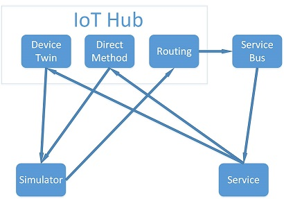

# Update IoT Devices Using Device Twins, Direct Methods and Message Routing 
 
## Overview 
 
In this workshop you will explore Azure IoT Hub's Device Twin, Direct Methods 
and Routing capabilities.  All three features will be exercised through the 
implementation of a simulated device and a mock cloud application. 
The complete solution has been provided in the repository's 
[Completed Solution](CompletedSolution/) folder, in the event that you 
need a reference. 
 
## Index 
- [Scenario](#scenario)
  - [Example Work Flow](#example-work-flow)
  - [Technologies](#technologies)
  - [Termonology](#terminology)
  - [Prerequisites](#prerequisites)
  - [Extra Credit](#extra-credit)
- [Solution Setup](#solution-setup) 
  - [Simulator](#simulator) 
  - [Service Application](#service-application) 
  - [Configuration](#configuration) 
- [Creating an Azure Service Bus](#creating-an-azure-service-bus) 
- [Creating an IoT Hub](#creating-an-iot-hub) 
  - [Add IoT Hub Endpoint](#add-iot-hub-endpoint) 
- [Add Test Device to IoT Hub](#add-test-device-to-iot-hub) 
- [Creating Device Simulator](#creating-device-simulator) 
- [Create Service Application](#create-service-application) 
- [Send Desired Configuration](#send-desired-configuration) 
- [Add Desired Property Change Handler](#add-desired-property-change-handler) 
- [Create Critical Notification Monitor](#create-critical-notification-monitor) 
- [Add Direct Method to Activate Requested Change](#add-direct-method-to-activate-requested-change) 
- [Run Solution](#run-solution) 
- [Extra Credit - Twin Reported Configuration](#extra-credit-1---twin-reported-configuration) 
- [Extra Credit - Push notifications with Flow](#extra-credit-2---push-notifications-with-flow) 
 
## Scenario 

The primary role of the *Internet of Things* is to help us facilitate a deeper 
understanding of, and to potentially augment, the world around us.  IoT architectures 
come in two flavors defined by communication styles and each presents challenges, 
advantages and disadvantages. 

In what is often thought of as the 'simple' case are solutions that leverage one-way 
communication (device to data collection system only).  These systems typically leverage 
low cost devices that are easy to deploy and easy to discard or abandon.  In these solutions 
the hardware typically requires considerable upfront planning and engineering to keep 
operation costs in check, the net result being an ROI that is often easier to calculate. 
Additionally, these systems tend to be time series or event driven, making data 
persistence a top priority. 

Conversely, systems that leverage bidirectional communication require more expensive 
hardware that naturally has more capabilities.  The system complexity is then shifted 
toward the application layer where business logic can be implemented and deployed 
dynamically.  With fungible/adaptable software in play, solutions can realize additional 
ROI as the business deepens its operational understanding of the deployed system.  Where 
unidirectional systems focus on events, bidirectional systems are often resource driven, 
leveraging client/server and interactivity paradigms.    

In this workshop, we will be implementing a SCADA or Supervisory Control and 
Data Acquisition system, leveraging *Azure's IoT Hub*.  The architecture 
of a SCADA system includes a centralized supervisory control system networked
to a collection remote processing modules that execute process tasks and relay 
environmental information. 

You will be building two applications, the *Simulator*, which will mimic an 
IoT field device that has a flexible runtime, and the *Service*, which represents 
a cloud based command and control supervisory application.  In this workshop, you will 
explore how:

- [Device Twins](https://docs.microsoft.com/en-us/azure/iot-hub/iot-hub-devguide-device-twins) 
can be leveraged to pass configuration and state data bidirectionally between a 
remote device and the cloud.
- [IoT Hub Routes](https://docs.microsoft.com/en-us/azure/iot-hub/iot-hub-devguide-endpoints#custom-routing-endpoints) 
can facilitate the real time distribution of events to specific consumers and data processors.
- [Direct Methods](https://docs.microsoft.com/en-us/azure/iot-hub/iot-hub-devguide-direct-methods) 
can be utilized to coordinate behavior changes in one or more remote devices by calling 
specific methods in the remote device's code base.
   
Additionally, the workshop solution file includes a small console application that will be 
used to register the *Simulator* as a device with the *IoT Hub*.  Lastly, the Simulator, 
Service and Device Registration applications, will all reference a *Core* project which 
includes shared types, configuration file accessor methods and a few useful extenion methods.



### Example Work Flow

The example work flow that will be implemented is as follows: 

- The Service application will leverage a *Device Twin* to pass values entered into its 
Console onto the Twin's *Desired Configuration* projection.
- The Simulator will listen for Device Twin Desired Configuration changes, 
and perform validation on the requested configuration value. 
- The Simulator will then send a message marked as **Critical** to the IoT Hub 
indicating the success or failure of the validation step.  These messages will 
be filtered and forwarded to an *Azure Service Bus* by using *Azure IoT Hub Routes*. 
- The Service Application will subscribe to the Azure Service Bus and on validation 
failure, it will display an error message to the user. 
- On validation success, the Service application will use a *Direct Method* to 
instruct the Device to apply the desired configuration change permanently.  The 
device will then alter its reporting frequency.

### Technologies 
 
- [IoT Hub](https://azure.microsoft.com/en-us/services/iot-hub/) - used 
    - [Device Twins](https://docs.microsoft.com/en-us/azure/iot-hub/iot-hub-devguide-device-twins) 
    - [Direct Methods](https://docs.microsoft.com/en-us/azure/iot-hub/iot-hub-devguide-direct-methods) 
    - [Routes](https://docs.microsoft.com/en-us/azure/iot-hub/iot-hub-devguide-endpoints#custom-routing-endpoints) 
- [Service Bus](https://azure.microsoft.com/en-us/services/service-bus/)
 
### Terminology

| Term  | Description |
| :------------ | :------------ |
| Simulator  | the application the represents a remote device  |
| Service  | the application that controls the *Simulator*  |
| CreateDeviceIdentity | the application that will register the *Simulator* with the *IoT Hub*  |
| Device Twin  | a cloud based projection of a device, facilitating bidirectional information flow  |
| Direct Method  | an interface and execution mechanism for invoking methods on a remote device  |
| Desired Configuration  | configuration in a Device Twin that the remote device should use  |
| Reported Configuration  | the configuration in a Device Twin as reported by the remote device  |
| Notification |  a message from the simulator to IoT Hub with information about configuration change requests |


### Prerequisites 
 
To complete the workshop you will need the following: 
- Microsoft Visual Studio 2015 
- An active Azure Account. (If you do not have an account, you can create 
a [free account](http://azure.microsoft.com/pricing/free-trial/) in just a few 
minutes.) 
 
### Extra Credit 
 
If you complete the workshop, there are several *Extra Credit* 
exercises that explore Device Twin Reported Configurations and the 
integration of Push Notifications into the workflow with Microsoft Flow. 

 
## Solution Setup 
 
### Simulator 
 
1. Open the [TwinsRoutingMethods solution file](/TwinsRoutingMethods.sln) in Visual Studio. 
 
2. Add a new project for the device *Simulator*. Click **File** > **Add** > 
**New Project...**, Select **Visual C#** > **Windows** > **Console Application**, 
in the *Name* box enter **Simulator**. 
 
3. Add a *Project Reference* to the included *Core* project. Right click on the project 
in the *Solution Explorer*, and Select **Add** > **Reference**.  From the left nav, 
select **Project** > **Solution**, and add the **Core** project. 
 
4. Use Nuget to add **Microsoft.Azure.Devices.Client** package.  Right click on the 
*Simulator* project, select **Manage Nuget Packages...**.  In the dialog, browse for 
the **Microsoft.Azure.Devices.Client** package, and install.  You may need to **Update** 
several dependent packages after installation. 
 
### Service Application 
 
1. Add a new project for the *Service* application. Click **File** > **Add** > 
**New Project...**, Select **Visual C#** > **Windows** > **Console Application**, 
in the *Name* box enter **Service**. 
 
2. Add a *Project Reference* to the included *Core* project. Right click on the project 
in the *Solution Explorer*, and Select **Add** > **Reference**.  From the left nav, 
select **Project** > **Solution**, and add the *Core* project. 
 
3. Use Nuget to add the **Microsoft.Azure.Devices.Client** and **WindowsAzure.ServiceBus** 
packages.  Right click on the *Simulator* project, select **Manage Nuget Packages...**. 
In the dialog, browse for both packages, and install.  You may need to **Update** several 
dependent packages after installation. 
 
### Configuration 
 
1. Create a local config.yaml file.  In the *Solution Explorer*, open the *config* solution 
folder.  Copy and rename *config.default.yaml* -> *config.yaml*. 
 
## Creating an Azure Service Bus 
 
1. Sign into the [Azure Portal](https://portal.azure.com/). 
 
2. In the Jumpbar, click **New** > **Enterprise Integration** > **Service Bus** 
 
3. In the *Service Bus* blade, configure your Service Bus, selecting the appropriate 
pricing tier. 
 
    - In the **Name** box, enter a name for your Service Bus. If the **Name** is valid and 
    available, a green check mark appears in the **Name** box. 
    - Select a [pricing and scale tier](https://azure.microsoft.com/en-us/pricing/details/service-bus/). 
    This tutorial does not require a specific tier.  For this workshop, use the Basic tier. 
    - In **Resource Group**, either create a resource group, or select an existing one. For 
    more information, see [Using resource groups to manage your Azure resources](https://docs.microsoft.com/en-us/azure/azure-resource-manager/resource-group-portal). 
    It is suggested that you create a new, dedicated resource group for this workshop 
    to facilitate easy resource removal at the end of the workshop. 
    - In **Location**, select the location to host your Service Bus. For this workshop, 
    choose your nearest location. 
 
4. When you have chosen your Service Bus configuration options, click **Create**.  It can 
take a few minutes for Azure to create the new Service Bus.  To check the status you can monitor 
the process on the Startboard or in the Notification panel. 
 
5. When the Service Bus has been successfully created, click the new tile for your Service Bus in the Azure 
portal to open the blade for the new Service Bus. 
 
6. In the **Shared access policies** blade, click the **Add** button and create a new 
policy with the **Listener** claim.  Press **Create**.  After the claim has been created, 
select the **Listener** claim, and in *Policy:Listener* blade the copy the 
*CONNECTION STRING -PRIMARY KEY* value and paste it into the *config.yaml* file 
of your solution under **AzureServiceBusConfig** > **ConnectionString**.  The connection 
string should look like: 
`Endpoint=sb://{Service Bus Name}.servicebus.windows.net/;SharedAccessKeyName=Listener;SharedAccessKey={Shared Access Key}` 
 
7. In the **Queues** blade, click the **Add** button and create a new queue for 
*critical-notifications*.  In the **Name** box, enter `critical-notifications` and press **Create**. 
 
8. Back in the solution's *config.yaml* file, set the **AzureServiceBusConfig** > **QueueName** 
field to the same value (`critical-notifications`). 
 
 
## Creating an IoT Hub 
 
1. In the Azure Portal Jumpbar, click **New** > **Internet of Things** > **IoT Hub**. 
 
2. In the *IoT Hub* blade, configure your IoT Hub, selecting the appropriate pricing tier. 
    - In the **Name** box, enter a name for your IoT HUb. If the **Name** is valid and 
    available, a green check mark appears in the **Name** box. 
    - Select a [pricing and scale tier](https://azure.microsoft.com/en-us/pricing/details/iot-hub/). 
    This tutorial does not require a specific tier.  For this workshop, use the Free tier. 
    Note: the *Extra Credit* will require at least the **Basic** tier. 
    - In **Resource Group**, select the resource group created in the previous section. For 
    more information, see [Using resource groups to manage your Azure resources](https://docs.microsoft.com/en-us/azure/azure-resource-manager/resource-group-portal). 
    - In **Location**, select the location to host your IoT Hub. For this workshop, 
    choose the same location used in the previous section. 
 
3. When you have chosen your IoT Hub configurations options, click **Create**.  It can 
take a few minutes for Azure to create your IoT Hub.  To check the status you can monitor 
the process on the Startboard or in the Notification panel. 
 
4. When the IoT Hub has been successfully created, click the new tile for your IoT Hub in 
the Azure portal to open the blade for the new IoT Hub. 
 
5. Populate the solution's *config.yaml* file with required settings from the IoT Hub. 
    - In the *Overview* blade, copy the **Hostname** value. 
    - In the solution's *config.yaml* file, paste the *Hostname* value into the **AzureIoTHubConfig** > 
    **Hostname** field.  The value shoud look like `{IoT Hub Name}.azure-devices.net`. 
    - In the *Shared access policies* blade, select the *iothubowner* policy. Copy the *Connection string-primary key*. 
    - In the solution's *config.yaml*, paste the connection string into the **AzureIoTHubConfig** > 
    **ConnectionString** field.  The connection string should look like: 
    `HostName={Iot Hub Name}.azure-devices.net;SharedAccessKeyName=iothubowner;SharedAccessKey={Shared Access Key}` 
 
Note: *IoT Hub* supports fine grain control of access and permissions; non-trivial applications 
should leverage these feature.  Please reference the [Control access to IoT Hub](https://docs.microsoft.com/en-us/azure/iot-hub/iot-hub-devguide-security) 
document for further information on access control and permissions.

### Add IoT Hub Endpoint 
 
1. In the *Endpoints* blade of the *IoT Hub*, select **Add**. 
 
2. In the *Add endpoint* blade, configure the new endpoint. 
    - In the *Name* box, enter a name for the new Endpoint. 
    - Select an *Endpoint type* of **Service Bus Queue**. 
    - In the *Service Bus namespace* dropdown, select the previously created *Service Bus*. 
    - In the *Service Bus queue* dropdown, select the *critical-notifications* queue. 
 
3. Click **OK** to create the new *Endpoint* 
 
### Add IoT Hub Route 
 
1. In the *Routes* blade of the *IoT Hub*, select **Add**. 
 
2. In the *Create new route* blade, configure the new route. 
    - In the *Name* box, enter a name for the new route. 
    - In the *Data source* dropdown, select **Device Messages**. 
    - Set the *Endpoint* to the **critical-notifications* endpoint created above. 
    - Make sure the *Enable Rule* toggle is set to **On**. 
    - In the *Query string* box, enter `severity="Critical"`. 
    - In the *Test the route* box paste the following JSON: 
 
    ```JAVASCRIPT 
    { 
    "devicemessage": { 
        "appProperties": { 
        "severity": "Critical" 
        } 
    } 
    } 
    ``` 
 
    - Press **Run** and ensure the *Result* equals *Match*. 
    - Press **Save** to create the new Route. 
 
## Add Test Device to IoT Hub 
 
1. Open the *config* > *config.yaml* file. 
 
2. Under the *DeviceConfigs* section of the YAML file, add a unique value for the *DeviceId* 
field. 
 
3. Run the **CreateDeviceIdentity** project. In the Solution Explorer, right click on the 
*CreateDeviceIdentity* project and select **Set as Startup Project**.  Running the solution 
will add a [Device Identity](https://docs.microsoft.com/en-us/azure/iot-hub/iot-hub-csharp-csharp-getstarted#create-a-device-identity) 
for the test Device to your *IoT Hub*.  The console application will automatically insert and 
save to the solutions's *config.yaml* file, the device key generated by your IoT Hub. 
 
## Creating Device Simulator 
 
1. Open the *Simulator* project, right click on the *Program.cs* file and select **Rename**. 
Enter **Simulator.cs** at the prompt and allow Visual Studio to rename the class as well. 
 
2. Add the following `using` statements at the top: 
    
    ```C# 
    using System; 
    using System.Linq; 
    using System.Net; 
    using System.Text; 
    using System.Threading; 
    using System.Threading.Tasks; 
    using Core; 
    using Microsoft.Azure.Devices.Client; 
    using Microsoft.Azure.Devices.Shared; 
    using Newtonsoft.Json; 
    using TransportType = Microsoft.Azure.Devices.Client.TransportType; 
    using Type = Core.Type; 
    ``` 
    
3. Add the following code to the *Simulator* class: 
    
    ```C# 
    private const int DefaultDelay = 5000; 
    private static DeviceClient _deviceClient; 
    private static DesiredDeviceTwinConfiguration _twinDesiredProperties; 
    private static int _messageSendDelay = DefaultDelay; 
    
    private static readonly object Locker = new object(); 
    private static Status _propertyChangeStatus = Status.Accepted; 
    
    ``` 
    
4. Add the Following code to the *Main* method: 
    
    ```C# 
    const string configFilePath = @"../../../config/config.yaml"; 
    var config = configFilePath.GetIoTConfiguration(); 
    var testDevice = config.DeviceConfigs.First(); 
    var azureConfig = config.AzureIoTHubConfig; 
    
    var cts = new CancellationTokenSource(); 
    
    _deviceClient = DeviceClient.Create( 
        azureConfig.Hostname, 
        new DeviceAuthenticationWithRegistrySymmetricKey(testDevice.DeviceId, testDevice.Key), 
        TransportType.Mqtt); 
    
    Console.WriteLine("Press any key to exit."); 
    Console.ReadLine(); 
    cts.Cancel(); 
    ``` 
    
    This code parses the *config.yaml* file into local varaibles and adds a 
    Cancellation Token that will be used to gracefully exit tasks that will be build later. 
    Then, it creates a *Device Client* that will be used to interact with the IoT Hub. 
 
5. Add the following method to the *Simulator* class which will initialize the device 
client's connection to IoT Hub: 
    
    ```C# 
    private static async Task Connect(DeviceClient deviceClient) 
    { 
        try 
        { 
            await deviceClient.OpenAsync(); 
        } 
        catch (Exception e) 
        { 
            Console.WriteLine(e); 
            throw; 
        } 
    } 
    ``` 
    
6. Add the following method to the *Simulator* class to initialize a local 
copy of the Device Twin's Desired Configuration. 
    
    ```C# 
    private static async Task GetInitialDesiredConfiguration(DeviceClient deviceClient) 
    { 
        var twin = await deviceClient.GetTwinAsync(); 
        _twinDesiredProperties = 
            JsonConvert.DeserializeObject<DesiredDeviceTwinConfiguration>( 
                twin.Properties.Desired["deviceTwinConfig"].ToString()); 
    } 
    ``` 
    
    Here we are deserializing the configuration to a type in the *Core* project, 
    making work with the Desired Configuration simpler and type safe. 
 
7. Call the `Connect` and `GetInitialDesiredConfiguration` methods from `Main` 
just after the *deviceClient* is initialized as follows: 
    
    ```C# 
    Task.Run(async () => 
        { 
            await Connect(_deviceClient); 
            await GetInitialDesiredConfiguration(_deviceClient); 
        }, cts.Token) 
    .Wait(cts.Token); 
    ``` 
    
    Additional methods will be added to this async lambda later. 
 
8. Next, add the following method to the *Simulator* class: 
    
    ```C# 
    private static async Task DataSend(DeviceClient deviceClient, CancellationToken cancellationToken) 
    { 
        while (true) 
        { 
            cancellationToken.ThrowIfCancellationRequested(); 
    
            var payload = Guid.NewGuid().ToString(); 
    
            $"{DateTime.Now:HH:mm:ss tt} - Sending Data: {payload}".LogMessage(ConsoleColor.White); 
    
            var message = new Message(Encoding.ASCII.GetBytes(payload)); 
            message.Properties.Add(MessageProperty.Severity.ToString("G"), Severity.Information.ToString("G")); 
    
            // Send the paylod to IoT Hub. 
            await deviceClient.SendEventAsync(message); 
    
            // lock for safe read of _messageSendDelay. 
            int delay; 
            lock (Locker) 
            { 
                delay = _messageSendDelay; 
            } 
            // Pause before next simulated device reading. 
            await Task.Delay(delay, cancellationToken); 
        } 
    } 
    ``` 

    This method runs a loop that will send a new GUID payload to the IoT Hub at 
    intervals specified by the `_messageSendDelay` field. We will leverage the 
    lock to ensure a consistent read of the `_messageSendDelay` field. 
    
    *Note/Extra Credit:* passing a `Func<int>` to retrieve the delay value 
    on each loop would likely be prefereable to enhance testability. 
 
9. Call the `DataSend` method from `Main` just after the *Connect* task, 
as follows: 
    
    ```C# 
    Task.Run(() => DataSend(_deviceClient, cts.Token), cts.Token); 
    ``` 
    
    The shell of the simulator application is now complete.  We'll be adding a few 
    callback and event handlers later in the workshop. 
 
## Create Service Application 
 
1. Open the *Service* project, right click on the *Program.cs* file and select **Rename**. 
Enter **Service.cs** at the prompt and allow Visual Studio to rename the class as well.  
 
2. Add the following `using` statements at the top of the file: 
 
    ```C# 
    using System; 
    using System.IO; 
    using System.Linq; 
    using System.Threading; 
    using System.Threading.Tasks; 
    using Core; 
    using Microsoft.Azure.Devices; 
    using Microsoft.Azure.Devices.Common; 
    using Microsoft.ServiceBus.Messaging; 
    using Newtonsoft.Json; 
    ``` 
 
3. Add the following code to the *Main* method: 
    
    ```C# 
    const string configFilePath = @"../../../config/config.yaml"; 
    var config = configFilePath.GetIoTConfiguration(); 
    var testDevice = config.DeviceConfigs.First(); 
    var azureConfig = config.AzureIoTHubConfig; 
    var serviceBusConfig = config.AzureServiceBusConfig; 
    
    var cts = new CancellationTokenSource(); 
    var registryManager = RegistryManager.CreateFromConnectionString(azureConfig.ConnectionString); 
    
    var consoleReadTask = Task.Run(async () => { 
        while (true) 
        { 
            Console.WriteLine("Enter a value to set device reporting frequency (in MS) or `exit` to terminate: "); 
    
            var userInput = Console.ReadLine(); 
            var newMessageSendDelayValue = userInput.IsNullOrWhiteSpace() ? "" : userInput?.ToLowerInvariant(); 
            switch (newMessageSendDelayValue) 
            { 
                // Allow the user to exit the application gracefully 
                case "exit": 
                    cts.Cancel(); 
                    return; 
    
                default: 
                    break; 
            } 
        } 
    }, cts.Token); 
    
    Task.WaitAll(consoleReadTask); 
    
    ``` 
 
This code parses the configuration file information and sets up the Device Registry Manager. Additionally, 
it creates the shell of a Task to read user input from the Console. 
 
## Send Desired Configuration 
 
Each time a user enters a value in the console, the Service application will relay 
the configuration change request to the device, leveraging the IoT Hub's Device Twin 
capabilities.  The Twin is a bi-directional cloud based projection of the device, 
through which configuration and status information can flow. 
 
1. In *Service.cs* add the following method that selects the device twin information 
from the IoT Hub and prints the results to the console: 
    
    ```C# 
    private static async Task QueryTwinConfiguration(RegistryManager registryManager, string deviceId) 
    { 
        var query = registryManager.CreateQuery($"SELECT * FROM devices WHERE deviceId = '{deviceId}'"); 
        var results = await query.GetNextAsTwinAsync(); 
    
        foreach (var result in results) 
        { 
            Console.WriteLine(); 
            $"Config report for: {result.DeviceId}".LogMessage(ConsoleColor.DarkYellow); 
    
            $"Desired deviceTwinConfig: {JsonConvert.SerializeObject(result.Properties.Desired, Formatting.Indented)}" 
                .LogMessage(ConsoleColor.Yellow); 
    
            Console.WriteLine(); 
        } 
    } 
    ``` 
    
    This method can be called anytime you wish to display the Device Twin's Desired or Reported 
    Configuration information. 
 
2.  Next, add a method that will send the Desired configuration information to the 
Device Twin: 
    
    ```C# 
    private static async Task SendDesiredConfiguration( 
        RegistryManager registryManager, 
        string deviceId, 
        CancellationToken cancellationToken, 
        string newMessageSendDelayValue) 
    { 
        // Get the latest Device Twin State 
        var twin = await registryManager.GetTwinAsync(deviceId, cancellationToken); 
    
        var patch = new 
        { 
            properties = new 
            { 
                desired = new 
                { 
                    deviceTwinConfig = 
                    new DesiredDeviceTwinConfiguration(Guid.NewGuid().ToString(), 
                        newMessageSendDelayValue) 
                } 
            } 
        }; 
    
        ($"Sending desired configuration change for setting `messageSendDelay` with value: " + 
            "{newMessageSendDelayValue} to deviceId: {deviceId}").LogMessage(ConsoleColor.Green); 
    
        await 
            registryManager.UpdateTwinAsync(twin.DeviceId, JsonConvert.SerializeObject(patch), twin.ETag, 
                cancellationToken); 
        await 
            Task.Run(() => QueryTwinConfiguration(registryManager, deviceId), cancellationToken); 
    } 
    ``` 
    
    This method - 
        - Gets the latest Device Twin information 
        - Defines a new `patch` object used to update the Device Twin 
        - Updates the Device Twin 
        - Logs the current *Desired Configuration* to the console. 
    
3. Lastly, add the following line to the *default* case of the `consoleReadTask` task 
in the *Main* method: 
    
    ```C# 
    await SendDesiredConfiguration(registryManager, testDevice.DeviceId, cts.Token, newMessageSendDelayValue); 
    break; 
    ``` 
 
## Add Desired Property Change Handler 
 
The next step is to have the *Simulator* monitor for change requests and stage them for application by 
the *Direct Method*.  In this process, the *Simulator* will send an event to the IoT Hub indicating 
whether or not the configuration change request validation was successful. 
 
1. Add the following method to *Simulator.cs*: 
    
    ```C# 
    private static async Task OnDesiredPropertyChange(TwinCollection desiredproperties, object usercontext) 
    { 
        if (desiredproperties.Contains("deviceTwinConfig")) 
        { 
            Message message; 
    
            var deviceTwinConfig = 
                JsonConvert.DeserializeObject<DesiredDeviceTwinConfiguration>( 
                    desiredproperties["deviceTwinConfig"].ToString()); 
    
            // ignore delay for now. Just want to see if it can be parsed. 
            int delay; 
    
            if (int.TryParse(deviceTwinConfig.MessageSendDelay, out delay)) 
            { 
                
            } 
            else 
            { 
                
            } 
    
            await _deviceClient.SendEventAsync(message); 
        } 
    } 
    ``` 
    This handler ensures that the *Desired Configuration* contains the `deviceTwinConfig` object 
    and sets up validation for the requested configuration change.  The delay value will be 
    converted and applied during the call to the Direct Method later. 
 
2. In the validation failure case, the `else` branch of the above handler, add the 
following code: 

    ```C# 
    _propertyChangeStatus = Status.Rejected; 
    
    ($"Device Twin Property `messageSendDelay` is set to an illegal value: `{deviceTwinConfig.MessageSendDelay}`, " + 
        $"change status is 'rejected'. Sending Critical Notification.").LogMessage(ConsoleColor.Red); 
    
    message = new Message( 
        Encoding.ASCII.GetBytes( 
            $"Parameter messageSendDelay value: `{deviceTwinConfig.MessageSendDelay}`, could not be converted to an Int.")); 
    
    message.Properties.Add(MessageProperty.Type.ToString("G"), Type.ConfigChage.ToString("G")); 
    message.Properties.Add(MessageProperty.Status.ToString("G"), Status.Rejected.ToString("G")); 
    message.Properties.Add(MessageProperty.Severity.ToString("G"), Severity.Critical.ToString("G")); 
    ``` 
    
    This code will set the `_propertyChangeStatus` to **Rejected** and create a new **Critical** notification 
    to be sent to the IoT Hub.  Since the message is flagged with the *Severity* property set to 
    **Critical**, the *IoT Hub*'s routing will kick in and forward the message onto the *Service Bus*. 
    
3. In the validation *success* case, the `if` branch of the `OnDesiredPropertyChange` handler, 
add the following code: 
    
    ```C# 
    lock (Locker) 
    { 
        _twinDesiredProperties = deviceTwinConfig; 
        _propertyChangeStatus = Status.Pending; 
    } 
    message = new Message( 
        Encoding.ASCII.GetBytes( 
            $"Device accepted messageSendDelay value: `{deviceTwinConfig.MessageSendDelay}`.  Property change is pending call to 'acceptDesiredProperties'.") 
    ); 
    
    message.Properties.Add(MessageProperty.Type.ToString("G"), Type.ConfigChage.ToString("G")); 
    message.Properties.Add(MessageProperty.Status.ToString("G"), Status.Pending.ToString("G")); 
    message.Properties.Add(MessageProperty.Severity.ToString("G"), Severity.Critical.ToString("G")); 
    ``` 
    
    This code will lock our synchronizing object, update the *Simulator*'s fields and prepare a 
    critical *success* message to be sent to the IoT Hub.  As with the failure case, the **Critical** 
    message property will be processed by the IoT Hub's routing mechanism, forwarding it onto the 
    Service Bus. 
 
4. Lastly, register the `OnDesiredPropertyChange` callback handler in *Main* by adding the following 
line inside the initialization task, just after `await Connect(_deviceClient);`: 
    
    ```C# 
    // Add Callback for Desired Configuration changes. 
    await _deviceClient.SetDesiredPropertyUpdateCallback(OnDesiredPropertyChange, null); 
    ``` 
    
    
## Create Critical Notification Monitor 
 
With messages marked as **Critical** flowing to the the custom *IoT Hub Route*, and onto the 
Service Bus, we now need to write a Service application handler to process them.  The 
handler will process Service Bus messages based on their *Status*.  For messages where 
the desired configuration value validation succeeded, the code will invoke a 
*Direct Method* on the device, making the configuration change permanent. 
 
1.  Add the following code to the *Service* class: 
    
    ```C# 
    private static void CriticalNotificationMonitor( 
        AzureServiceBusConfig serviceBusConfig, 
        string iotHubConnectionString, 
        string deviceId, 
        CancellationToken token) 
    { 
        var client = QueueClient.CreateFromConnectionString(serviceBusConfig.ConnectionString, 
            serviceBusConfig.QueueName); 
    
        var serviceClient = ServiceClient.CreateFromConnectionString(iotHubConnectionString); 
    
        client.OnMessage(async message => 
        { 
    
        }); 
    } 
    ``` 
    The method configures a *Service Bus* client and defines a callback, the lambda in `Onmessage`. 
    Additionally, it creates a Service Client that will be used to call the *Direct Method* 
    implemented in the *Simulator*. 
 
2. In the body of the `OnMessage` call, add the following code: 
    
    ```C# 
        var status = (Status) Enum.Parse( 
                        typeof(Status), 
                        (string) message.Properties[MessageProperty.Status.ToString("G")]); 
    ``` 
    Though the code completion benefits of using `enum`s for state representation 
    are helpful, crossing domain boundaries with them can be cause for exceptionally 
    verbose code, like the parse statement above.  Use this technique with caution; 
    for an alternate approach, check out the concept of 
    [Enumeration Classes](https://lostechies.com/jimmybogard/2008/08/12/enumeration-classes/). 
 
3. Add a `switch` statement below `var status ...` to process the various message 
*Status* cases: 
    
    ```C# 
    switch (status) 
    { 
        case Status.Pending: 
            break; 
        case Status.Rejected: 
            break; 
        case Status.Accepted: 
        case Status.PreconditionFailed: 
        default: 
            throw new ArgumentException(); 
    } 
    ``` 
    
    We are primarily interested in messages that have a either **Pending** or **Rejected** 
    status; all others can simply result in an `ArgumentException`. 
 
4. For desired configuration values that failed validation, **Rejected** case,
simply log them to the console: 
    
    ```C# 
    var body = new StreamReader(message.GetBody<Stream>()).ReadToEnd(); 
    $"Setting value was rejected by the device: '{deviceId}' with message: '{body}'. Please enter a new legal value: " 
        .LogMessage(ConsoleColor.Red); 
    break; 
    ``` 
    
    The code reads the body of the message as a `Stream` and logs an error message to the console.
 
5. If the desired configuration passed validation then we'll use the Service Client to call a 
direct method on the client as follows: 
    
    ```C# 
    // Send message to accept state change. 
    var method = new CloudToDeviceMethod(DeviceMethods.AcceptDesiredProperties.ToString("G"), 
        TimeSpan.FromSeconds(30)); 
    
    var result = await serviceClient.InvokeDeviceMethodAsync(deviceId, method, token); 
    
    $"Device responded with result code: {result.Status} and message: {result.GetPayloadAsJson()}" 
        .LogMessage(ConsoleColor.Green); 
    break; 
    ``` 
    
    The code creates a new `CloudToDeviceMethod` which is configured invoke the Direct Method 
    handler bound to **AcceptDesiredProperties**.  It then uses the ~Service Client` to 
    invoke the *Direct Method* and reports the result. 
    
6. In the *Service* `Main` method, before the `consoleReadTask`, add the following code to bind the handler: 
    
    ```C# 
    CriticalNotificationMonitor(serviceBusConfig, azureConfig.ConnectionString, testDevice.DeviceId, cts.Token); 
    ``` 
    
## Add Direct Method to Activate Requested Change 
 
We need to now add, and wire up a method that can answer calls to the *AcceptDesiredProperties* 
*Direct Method*. 
 
1. Open the *Simulator* class and add the following method stub to the class: 
    
    ```C# 
    private static Task<MethodResponse> OnAcceptDesiredProperty(MethodRequest request, object context) 
    { 
        MethodResponse response; 
    
        if (Monitor.TryEnter(Locker) && (_propertyChangeStatus == Status.Pending)) 
        { 
            // Locker object can be locked and property change statis is Pending. 
        } 
        else 
        { 
            // Lock could not be obtained or property change status != Pending. 
        } 
        return 
            Task.FromResult(response); 
    } 
    ``` 
    
    This method defines a response object that well be sent back as the result of one of 
    the following cases: 
    - Lock object is available and the `_propertyChangeStatus` is set to **Pending**, 
    indicating that the configuration change request can be applied. 
    - Lock object is not available becuase a configuration change request is being executed 
    or the `_propertyChangeStatus` is set to any other value than **Pending**. 
    
2. In the second case, the `else` branch, add the following code: 
    
    ```C# 
    // Note: Precondition failed status code should really only be used with precondition headers; 
    // but Direct Methods do not allow access to headers to check precondition assertions. 
    
    const int httpPreconditionFailedStatusCode = 412; 
    
    var lockedResponseMessage = new 
    { 
        AcceptanceRequestDateTime = DateTime.UtcNow, 
        Status = Status.PreconditionFailed.ToString("G"), 
        Message = "A precondition for acceptance of the desired configuration change, failed." 
    }; 
    
    response = new MethodResponse( 
        Encoding.ASCII.GetBytes(JsonConvert.SerializeObject(lockedResponseMessage)), 
        httpPreconditionFailedStatusCode 
    ); 
    ``` 
    
    As noted in the comments, *Direct Methods* do not expose the original cloud side 
    http request headers.  Typically, we would want the client, 
    the Service application, to make an assertion about the required state of the server, 
    the Simulator, as a precondition for fulfilment of the request. Despite not being 
    able to leverage a *Precondition header* typically associated with a 412 response, 
    will use the *Precondition Failed* response code because the server's state was 
    technically unacceptable for successful processing of the request. 
    
3. In the successful path, the `if` branch, add the following code: 
    
    ```C# 
    try 
    { 
        $"Updating message send delay from {_messageSendDelay} to {_twinDesiredProperties.MessageSendDelay}. Change will take effect immediatly." 
            .LogMessage(ConsoleColor.Green); 
    
        _messageSendDelay = int.Parse(_twinDesiredProperties.MessageSendDelay); 
        _propertyChangeStatus = Status.Accepted; 
        var responseMessage = new 
        { 
            AcceptanceRequestDateTime = DateTime.UtcNow, 
            Status = _propertyChangeStatus, 
            Message = "'MessageSendDelay' change accepted by device" 
        }; 
        response = new MethodResponse( 
            Encoding.ASCII.GetBytes(JsonConvert.SerializeObject(responseMessage)), 
            (int) HttpStatusCode.OK); 
    } 
    finally 
    { 
        Monitor.Exit(Locker); 
    } 
    ``` 
    
    In this branch, we have acquired  a lock to safely modify both the `_propertyChangeStatus` 
    and `_messageSendDelay` fields.  Additionally we create a response message for relay 
    back to the client, indicating successful application of the desired property. Lastly, 
    we need to make sure to release the lock we acquired in the `if` statement. 
    
4. Now, modify the initialization task in the *Simulator.cs* to register the 
*Direct Method* handler. 

    ```C#
    _deviceClient.SetMethodHandler("AcceptDesiredProperties", OnAcceptDesiredProperty, null);
    ```

    The complete Task should look like the following: 
    
    ```C# 
    // execute initial connect synchronously 
    Task.Run(async () => 
    { 
        await Connect(_deviceClient); 
        await GetInitialDesiredConfiguration(_deviceClient); 
    
        // Add Callback for Desired Configuration changes. 
        await _deviceClient.SetDesiredPropertyUpdateCallback(OnDesiredPropertyChange, null); 
    
        // Add Handler to set property request 
        _deviceClient.SetMethodHandler("AcceptDesiredProperties", OnAcceptDesiredProperty, null); 
    } 
    , cts.Token) 
    .Wait(cts.Token); 
    ``` 
    
    The `OnAcceptDesiredProperty` handler will now be called anytime the *AcceptDesiredProperties* 
    Direct Method is called. 
    
    
## Run Solution 
 
1. Right Click on the Solution in the Visual Studio *Solution Explorer*, Select **Set Startup Projects ...** 
2. Check **Multiple startup projects** and set the *Service* and *Simulator* projects to **Start** 
3. Click **Apply** and **OK** 
4. Run the Solution 
5. Try entering new millisecond values at the prompt, or illegal values like 'moose'. 

## Wrap-up

1. In the Azure Portal, select *Resource groups* from the Jumpbar.
2. From the list of resource groups, select the resource group associated with this workshop.
3. Click **Delete** at the top of the resource group blade.
4. Follow the prompts to remove all the resources associated with this workshop.
 
## Extra Credit 1 - Twin Reported Configuration 
 
1. In the *Simulator* application's `OnAcceptDesiredProperty` method, make a change 
to the success branch to update the Device Twin's Reported Configuration with the 
accepted _messageSendDelay value.  Here is some example code to work from: 
    
    ```C# 
    TwinCollection reportedProperties = new TwinCollection(); 
    reportedProperties["DateTimeLastUpdated"] = DateTime.UtcNow; 
    
    Client.UpdateReportedPropertiesAsync(reportedProperties); 
    ``` 
 
2. In the *Service* application's `QueryTwinConfiguration` method print the device's 
reported configuration element.  In the `CriticalNotificationMonitor` method call 
`QueryTwinConfiguration` if the `serviceClient.InvokeDeviceMethodAsync` returns an 
HTTP status code equal to 200. 
 
## Extra Credit 2 - Push notifications with Flow 
 
1. Add a second Service Bus Queue to split *Pending* and *Rejected* notifications 
to discrete queues.
2. Recreate the IoT Hub with a **Basic** pricing tier. 
3. Add a new *Endpoint* and *Route* to split **Pending** and **Rejected** notifications. 
4. Modify the `CriticalNotificationMonitor` method of the Service project, adding 
discrete `OnMessage` handlers for both **Pending** and **Rejected** queues. 
5. In the **Rejected** handler add code to post the following JSON object to a URL. 
    ```JAVASCRIPT 
    { 
        "Type":"ConfigChange", 
        "Severity":"Critical", 
        "Message":"this is some text" 
    } 
    ``` 
6. Download the [Microsoft Flow](https://flow.microsoft.com/en-us/) application 
to your phone and sign in. 
7. Go to [Microsoft Flow](https://flow.microsoft.com/en-us/) and sign in with 
the same account used on your phone. 
    - Select *My flows* 
    - Select *Create a flow from blank* 
    - Select *Request* and enter the following JSON Schema: 
        ```JAVASCRIPT 
        { 
        "$schema": "http://json-schema.org/draft-04/schema#", 
        "type": "object", 
        "properties": { 
            "Type": { 
            "type": "string" 
            }, 
            "Severity": { 
            "type": "string" 
            }, 
            "Message": { 
            "type": "string" 
            } 
        }, 
        "required": [ 
            "Type", 
            "Severity", 
            "Message" 
        ] 
        } 
        ``` 
8. Add a **New Step** 
9. Select **Send a push notification**, enter "Received the following critical notification: ", 
press **Add dynamic content** and Select `Message` to add the *Message* property of the JSON 
object from the Request Body.  
10. Save the Flow, copy the generated URL in the *Request* step and use it in the *Rejected* 
queue flow in the Service Application. 
11. You should now receive push notifications to your phone every time a bad desired configuration 
value is sent to the simulator. 
